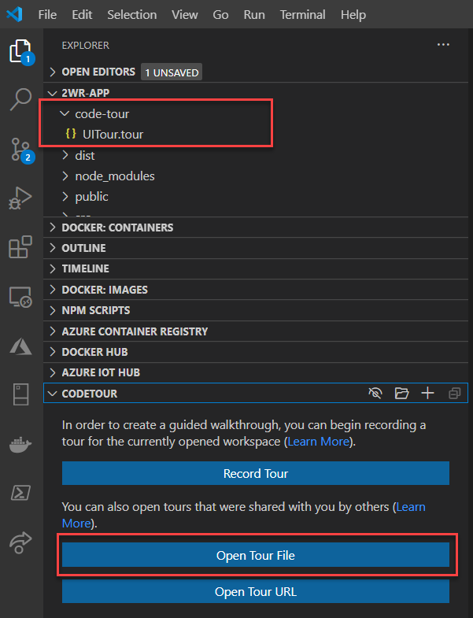

# 2wr-app

[](https://github.com/HTBox/TwoWeeksReady/actions?query=workflow%3A%222wr-app+CI%2FCD%22)

## Application wireframes

See [Application wireframes](https://xd.adobe.com/view/158c8bc4-5ef2-47dd-90c0-ba3c508e4d62-40df/grid)

## Material design icons

See [Material design icons](https://materialdesignicons.com/)

## CodeTour Onboarding

In VSCode, you can get a walk-through of the code via the [CodeTour](https://marketplace.visualstudio.com/items?itemName=vsls-contrib.codetour) extension. Install this extension, and review tours available in the 'CodeTour' folder.



## Project Prerequisites

1. Node.js 16.x.x LTS

## Project setup

```console
npm install
```

## Compiles and hot-reloads for development

```console
npm run serve
```

## Alternatively, you can run the functions and the Vue build for development

```console
npm run dev
```

We've started the process of moving to a two tier build names where dev processes are prefixed with dev: so that you can run all the process by building this way. You will notice that you can run these separated if needed:

### Just Serve the Vue PWA

```console
npm run dev:serve
```

### Just Start the Azure Function Project

```console
npm run dev:napi
```

**NOTE**: We will be moving all the processes to this once we complete changes to the CI Build.

## Compiles and minifies for production

```console
npm run build
```

## Run the api server

```console
npm run api
```

## Run the Azurite Server (Development Azure Storage Emulator)

If you're not running the API in Visual Studio (with the Azure SDK running), you'll need to run azurite for Storage Emulation:

```console
npm run azurite
```

You may need to install azurite globally:

```console
npm install -g azurite
```

Alternatively, there is an Azurite VS Code Extension:

[Install Azure Extension](https://docs.microsoft.com/en-us/azure/storage/common/storage-use-azurite#install-and-run-the-azurite-visual-studio-code-extension)

## Run production files after build

First line you only ever need to execute once.
Second line, execute every time prior to the third. (this is for the Powershell terminal, node terminal switch this to `export NODE_ENV=production` or `SET NODE_ENV=production`)

```Powershell
npm install -g serve
$env:NODE_ENV="production"
serve -s dist
```

## Lints and fixes files

```console
npm run lint
```

## Customize configuration

See [Configuration Reference](https://cli.vuejs.org/config/).

## Sample .env file

```text
NODE_ENV=development
VUE_APP_APIROOT=http://localhost:7071/api/
VUE_APP_AUTH0_DOMAIN=login.2wr.org
VUE_APP_AUTH0_CLIENTID=6TSzRpgtMKR3NI1D4Is1nGO6brBB2wB0
VUE_APP_AUTH0_AUDIENCE=https://2wrdev.azurewebsites.net
```
